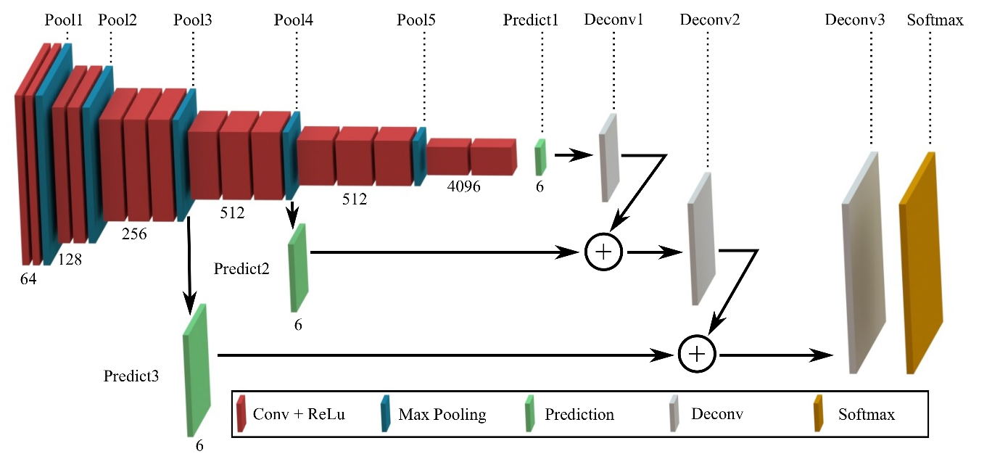
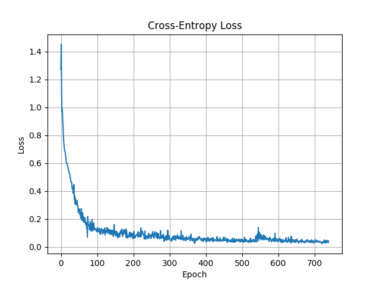
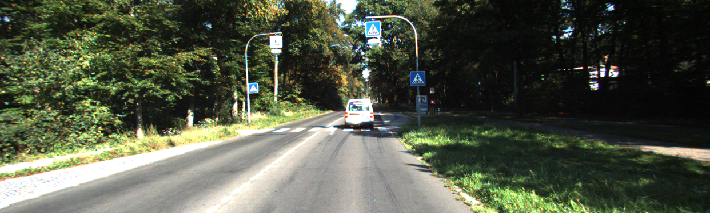
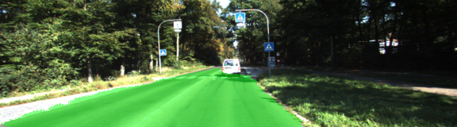

# Semantic Segmentation
## Overview
The object of this project is to label pixels of a road image using the Fully Convolutional Network (FCN) described in the [Fully Convolutional Networks for Semantic Segmentation](https://people.eecs.berkeley.edu/~jonlong/long_shelhamer_fcn.pdf) by Jonathan Long, Even Shelhamer, and Trevor Darrel.

## Fully Convolutional Network Visualization
Entire model structure is developed as below including three featrues such as 1x1 convolution, deconvolution(Transpose), and skip layer.


## Code Description
Most of the code is inside `main.py`. The code downloads a pre-trained VGG16 model and extract the input, keep probability, layer 3, layer 4 and layer 7 from it (function `load_vgg`int `main.py` from line 32 to line 56). Those layers are used in the function `layers` to create the rest of the network:
- One convolutional layer with kernel 1 from VGG's layer 7 (line 70)
- One deconvolutional layer with kernel 4 and stride 2 from the first convolutional layer (line 71)
- One convolutional layer with kernel 1 from VGG's layer 4 (line 72)
- The two layers above are added to create the first skip layer (line 73)
- One deconvolutional layer with kernel 4 and stride 2 from the first ship layer (line 74)
- One convolutional layer with kernel 1 from VGG's layer 3 (line 75)
- The two layers above are added to create the second skip layer (line 76)
- One deconvolutional layer with kernel 16 and stride 8 from the second skip layer (line 77)

Every created convolutional and deconvolutional layer use a random-normal kernel initializer with standard deviation 0.01 and a L2 kernel regularizer with L2 0.00001.

Once the network structure is defined, the optimizer and the cross-entropy lost is defined on the function `optimize` in `main.py`(from line 82 to line 99) method using [Adam optimizer](https://en.wikipedia.org/wiki/Stochastic_gradient_descent#Adam).

The network is trained using the function `train_nn` in `main.py`(from line 103 to line 126) using keep probability 0.8 and learning rate 0.0001. To facilitate the loss value analysis, later on, every batch loss values are stored in an array, and the cross-entropy losses are plotted for each batch.

## Hyperparameters
```python
L2_REG = 1e-5
STDEV = 1e-2
KEEP_PROB = 0.8
LEARNING_RATE = 1e-4
EPOCHS = 20
BATCH_SIZE = 8
IMAGE_SHAPE = (160, 576)
NUM_CLASSES = 2
```

## Training
The network training was dong for 20 epochs, and the following graph shows the loss performance


## Output

Original Image          |  Classified Image
:-------------------------:|:-------------------------:
  |  

### Setup
##### GPU
`main.py` will check to make sure you are using GPU - if you don't have a GPU on your system, you can use AWS or another cloud computing platform.
##### Frameworks and Packages
Make sure you have the following is installed:
 - [Python 3](https://www.python.org/)
 - [TensorFlow](https://www.tensorflow.org/)
 - [NumPy](http://www.numpy.org/)
 - [SciPy](https://www.scipy.org/)

You may also need [Python Image Library (PIL)](https://pillow.readthedocs.io/) for SciPy's `imresize` function.

##### Dataset
Download the [Kitti Road dataset](http://www.cvlibs.net/datasets/kitti/eval_road.php) from [here](http://www.cvlibs.net/download.php?file=data_road.zip).  Extract the dataset in the `data` folder.  This will create the folder `data_road` with all the training a test images.

### Start
##### Implement
Implement the code in the `main.py` module.

##### Run
Run the following command to run the project:
```
python main.py
```
**Note:** If running this in Jupyter Notebook system messages, such as those regarding test status, may appear in the terminal rather than the notebook.
 
### Tips
- The link for the frozen `VGG16` model is hardcoded into `helper.py`.  The model can be found [here](https://s3-us-west-1.amazonaws.com/udacity-selfdrivingcar/vgg.zip).
- The model is not vanilla `VGG16`, but a fully convolutional version, which already contains the 1x1 convolutions to replace the fully connected layers. Please see this [post](https://s3-us-west-1.amazonaws.com/udacity-selfdrivingcar/forum_archive/Semantic_Segmentation_advice.pdf) for more information.  A summary of additional points, follow. 
- The original FCN-8s was trained in stages. The authors later uploaded a version that was trained all at once to their GitHub repo.  The version in the GitHub repo has one important difference: The outputs of pooling layers 3 and 4 are scaled before they are fed into the 1x1 convolutions.  As a result, some students have found that the model learns much better with the scaling layers included. The model may not converge substantially faster, but may reach a higher IoU and accuracy. 
- When adding l2-regularization, setting a regularizer in the arguments of the `tf.layers` is not enough. Regularization loss terms must be manually added to your loss function. otherwise regularization is not implemented.

### Why Layer 3, 4 and 7?
In `main.py`, you'll notice that layers 3, 4 and 7 of VGG16 are utilized in creating skip layers for a fully convolutional network. The reasons for this are contained in the paper [Fully Convolutional Networks for Semantic Segmentation](https://arxiv.org/pdf/1605.06211.pdf).

In section 4.3, and further under header "Skip Architectures for Segmentation" and Figure 3, they note these provided for 8x, 16x and 32x upsampling, respectively. Using each of these in their FCN-8s was the most effective architecture they found. 

 

